# Web Crawler Coordinator Flowchart & Control Flow Guide

This document presents a comprehensive control flow diagram and structural explanation of the Web Crawler Coordinator (Version 4). It outlines initialization, database connection/resumption strategies, the main coordinator loop, page retrieval mechanisms (including conditional Chrome DevTools Protocol rendering), filtering pipelines, and deduplication logic.

---

## 1. System Flowchart (Mermaid)

The flowchart below traces every programmatic decision path, loop guard, configuration branch, and error handler in the crawl lifecycle.

```mermaid
flowchart TD
    %% Styling
    classDef init fill:#000000,stroke:#2b6cb0,stroke-width:2px;
    classDef decision fill:#000000,stroke:#dd6b20,stroke-width:2px;
    classDef process fill:#000000,stroke:#4a5568,stroke-width:1px;
    classDef error fill:#000000,stroke:#e53e3e,stroke-width:2px;
    classDef db fill:#000000,stroke:#38a169,stroke-width:2px;
    classDef success fill:#000000,stroke:#38a169,stroke-width:1.5px;

    %% ------------------ STARTUP & CONFIG ------------------
    Start([Start Crawler CLI]) ---> LoadConfig["ConfigLoader: Parse config/crawler.conf"]
    LoadConfig ---> ConnectDB["MySQLStorage: Connect to database"]
    
    ConnectDB -->|"Connection Failed"| FailExitDB["std::cout: 'MySQL connection failed'"]:::error
    FailExitDB ---> Exit1(Exit Program):::error

    ConnectDB -->|"Success"| CreateTables["MySQLStorage: Create Tables if not exist"]
    CreateTables -->|"Failed"| FailExitTables["std::cout: 'Failed to create tables'"]:::error
    FailExitTables ---> Exit2(Exit Program):::error

    %% ------------------ RESUME CONFIGURATION ------------------
    CreateTables -->|"Success"| CheckResume{resume_mode Configuration}:::decision
    
    CheckResume -->|"clear"| ClearDB["MySQLStorage: clearStorage"]:::db
    ClearDB ---> InitSeeds[Process Seed URLs]
    
    CheckResume -->|"keep"| KeepDB["Preserves DB records (Does not clear)"]:::db
    KeepDB ---> InitSeeds
    
    CheckResume -->|"resume"| LoadState["MySQLStorage: loadURLs"]:::db
    LoadState ---> ForEachLoaded{For each loaded URL}:::decision
    
    ForEachLoaded -->|"All processed"| InitSeeds
    ForEachLoaded -->|"URL found"| SeenAddResume["SeenStore: tryAdd url"]:::process
    SeenAddResume ---> UpdateStateResume["SeenStore: Set URLState from DB"]:::process
    UpdateStateResume ---> CheckStateResume{URLState in DB?}:::decision
    
    CheckStateResume -->|"Queued or Crawling"| Requeue["Frontier: enqueue URL"]:::process
    Requeue ---> ForEachLoaded
    CheckStateResume -->|"Completed or Failed"| CountState[Increment crawledpages / failedPages counter]:::process
    CountState ---> ForEachLoaded

    %% ------------------ SEED PROCESSING ------------------
    InitSeeds ---> AddSeed["Crawler::addSeed"]
    AddSeed ---> ParseSeed["URLParser: Parse URL"]
    ParseSeed ---> ValidateSeed{Valid Seed URL?}:::decision
    
    ValidateSeed -->|"No"| PrintInvalidSeed["std::cout: 'Invalid URL'"]:::error
    PrintInvalidSeed ---> CrawlLoop
    
    ValidateSeed -->|"Yes"| NormSeed["URLNormalizer: Normalize Seed"]
    NormSeed ---> FilterSeedCheck{"LinkFilter: shouldvisit?"}:::decision
    
    FilterSeedCheck -->|"No"| PrintBlockedSeed["std::cout: 'Blocked by LinkFilter'"]:::error
    PrintBlockedSeed ---> CrawlLoop
    
    FilterSeedCheck -->|"Yes"| SeenSeedCheck{"SeenStore: tryAdd seed?"}:::decision
    
    SeenSeedCheck -->|"No (Duplicate)"| CrawlLoop
    SeenSeedCheck --->|"Yes (Unique)"| QueueSeed["Frontier: enqueue Seed"]:::process
    QueueSeed ---> DBSeedQueued["MySQLStorage: insertURL seed as 'Queued'"]:::db
    DBSeedQueued ---> CrawlLoop

    %% ------------------ MAIN CRAWL LOOP ------------------
    CrawlLoop{While Frontier is NOT empty?}:::decision
    
    CrawlLoop -->|"Yes"| CheckMaxPages{crawledpages >= maxpages?}:::decision
    CheckMaxPages -->|"Yes"| PrintSummary[Print Coordinator Crawler Summary]:::process
    CheckMaxPages -->|"No"| DequeuePage["Frontier: dequeue next URLDepth"]:::process
    
    DequeuePage ---> StartCrawlPage["Crawler::crawlPage"]
    StartCrawlPage ---> DBCrawling["MySQLStorage: updateState to 'Crawling'"]:::db
    DBCrawling ---> FetchPage["PageFetcher: fetch URL"]

    %% ------------------ PAGE FETCH PIPELINE ------------------
    FetchPage ---> HttpFetch["HTTPFetcher: Perform raw GET request"]
    HttpFetch ---> CheckRenderReq{needsRendering?}:::decision
    
    CheckRenderReq -->|"No (Status 401/404/5xx)"| ReturnRawPage[Use raw webpage response]
    CheckRenderReq -->|"Yes (SPA tags id='root'/'app', small size, zero links, or empty html)"| StartBrowser{Is browser initialization successful?}:::decision
    
    StartBrowser -->|"No"| ReturnEmpty[Return empty HTML]
    StartBrowser -->|"Yes"| CDPNavigate["CDPConnection: navigate URL & waitForLoad"]
    CDPNavigate ---> GetCDPHTML["CDPConnection: getHTML"]
    
    GetCDPHTML -->|"Success"| MatchRendered["Update fetched HTML & set status 200"]
    GetCDPHTML -->|"Failure/Timeout"| StopBrowser["Stop process & reset CDP connection"]:::error
    StopBrowser ---> ReturnEmpty
    
    ReturnEmpty ---> CheckFetchSuccess
    ReturnRawPage ---> CheckFetchSuccess
    MatchRendered ---> CheckFetchSuccess

    %% ------------------ EVALUATING FETCHED CONTENT ------------------
    CheckFetchSuccess{Is page HTML empty?}:::decision
    
    CheckFetchSuccess -->|"Yes (Failed)"| TrackFail[Increment failedPages]:::process
    TrackFail ---> SeenFail["SeenStore: Set state 'Failed'"]:::process
    SeenFail ---> DBFail["MySQLStorage: updateState to 'Failed'"]:::db
    DBFail ---> CrawlLoop

    CheckFetchSuccess -->|"No (Success)"| MarkCompleted["SeenStore & MySQLStorage: Set state 'Completed'"]:::db
    MarkCompleted ---> SavePageContent["MySQLStorage: savePage HTML content"]:::db
    SavePageContent ---> ParseLinks["HTMLParser: extractlinks from HTML body"]
    ParseLinks ---> IterateLinks{For each extracted link}:::decision

    %% ------------------ LINK PROCESSING & FILTERING ------------------
    IterateLinks -->|"All evaluated"| CrawlLoop
    IterateLinks -->|"URL link"| CheckDepth{nextDepth > max_depth?}:::decision
    
    CheckDepth -->|"Yes"| RejectDepth[Increment maxDepthReached counter]:::process
    RejectDepth ---> IterateLinks
    
    CheckDepth -->|"No"| FastQuickFilter{"QuickFilter: shouldparse?"}:::decision
    
    FastQuickFilter -->|"No (Invalid syntax/tel/mailto)"| RejectFilter[Increment filteredLinks]:::process
    RejectFilter ---> IterateLinks
    
    FastQuickFilter -->|"Yes"| ParseLinkComponents["URLParser: parse link components"]
    ParseLinkComponents ---> ResolveRel{Is link relative?}:::decision
    
    ResolveRel -->|"Yes"| ResolvePath["URLNormalizer: resolverelative to base URL"]
    ResolveRel -->|"No"| HostCheck
    
    ResolvePath ---> HostCheck{"sameDomainOnly & Host != Seed Host?"}:::decision
    HostCheck -->|"Yes (Blocked)"| RejectFilter
    HostCheck -->|"No"| LinkFilterCheck{"LinkFilter: shouldvisit?"}:::decision
    
    LinkFilterCheck -->|"No (Blocked Domain/Extension)"| RejectFilter
    LinkFilterCheck -->|"Yes"| FinalNormalize["URLNormalizer: normalize & tostring"]
    
    FinalNormalize ---> SeenStoreCheck{"SeenStore: tryAdd final URL?"}:::decision
    
    SeenStoreCheck -->|"No (Duplicate)"| RejectDup[Increment duplicateLinks]:::process
    RejectDup ---> IterateLinks
    
    SeenStoreCheck -->|"Yes (Unique)"| DBEnqueueURL["MySQLStorage: insertURL as 'Queued'"]:::db
    DBEnqueueURL ---> FrontierEnqueue["Frontier: enqueue unique URLDepth"]:::process
    FrontierEnqueue ---> IterateLinks

    %% ------------------ TERMINATION ------------------
    CrawlLoop -->|"No (Queue Empty)"| PrintSummary
    PrintSummary ---> Exit0(["Start/Stop Browser & Exit Success"]):::success

    %% Class Assignings
    class Start,LoadConfig,ConnectDB,CreateTables init;
    class CheckResume,ForEachLoaded,CheckStateResume,ValidateSeed,FilterSeedCheck,SeenSeedCheck,CrawlLoop,CheckMaxPages,CheckRenderReq,StartBrowser,CheckFetchSuccess,IterateLinks,CheckDepth,FastQuickFilter,ResolveRel,HostCheck,LinkFilterCheck,SeenStoreCheck decision;
    class ClearDB,KeepDB,LoadState,DBSeedQueued,DBCrawling,DBFail,MarkCompleted,SavePageContent,DBEnqueueURL db;
    class FailExitDB,Exit1,FailExitTables,Exit2,PrintInvalidSeed,PrintBlockedSeed,StopBrowser error;
```

---

## 2. Decision Logic and Process Descriptions

### 2.1 Database Resumption Strategies
On startup, the system evaluates the configured `resume_mode`:
* **`clear`**: Executes a truncate/deletion query across database tables to ensure clean, isolated crawl statistics.
* **`keep`**: Preserves existing records in the database, allowing new crawls to execute without deleting previous records.
* **`resume`**: Performs an initial scan of the database (`MySQLStorage::loadURLs`). This method processes stored items:
  1. Registers previously crawled URLs directly into the **`SeenStore`** to avoid revisiting.
  2. Identifies URLs marked as `Queued` or interrupted (`Crawling`) and pushes them back into the `Frontier` priority queue to ensure no loss of crawl progression.

### 2.2 JavaScript Execution Decision (Needs Rendering)
To minimize resource footprint, the crawler avoids launching browser pages unless necessary. The `needsRendering` utility decides whether to skip browser rendering based on the initial HTTP response:
* **Skip rendering check (Return Raw HTTP HTML):** If the status code is a client or server error (e.g., `401 Unauthorized`, `404 Not Found`, or `>=500 Server Error`).
* **Trigger CDP Browser rendering:**
  * Raw HTML is completely empty or its payload size is smaller than the configured `render_min_size`.
  * The HTML body matches core Single-Page Application (SPA) container tags (e.g., `id="root"`, `id="app"`, `id="__next"`, `id="__nuxt"`).
  * The raw HTML contains zero outbound links.

### 2.3 Link Processing & Normalization Loop
For every link found on valid documents:
* **Structural Filtering**: `QuickFilter` immediately eliminates structural schemes (`mailto:`, `tel:`, `javascript:`).
* **Relative Resolution**: Relative resource pointers (such as `/blog/post-1`) are computed into root-relative strings using the seed host and protocol context.
* **Link Blocking**: Domains and file extensions matching entries in `blockeddomains.txt` and `blockedextensions.txt` are parsed case-insensitively and rejected.
* **Seen Deduplication**: If the normalized URL exists in the FNV-1a Hash Map tracker (`SeenStore`), it is flagged as a duplicate. Otherwise, it is written to the database and enqueued into the Frontier.
