# Crawler Design - Version 3
The objective of this project is to implement a web crawler capable of collecting web pages from the internet for use by a search engine . Starting from a seed URL the crawler visits pages , extracts hyperlinks , discovers new pages and stores the rendered HTML in a SQLite database .

- Crawl web pages using BFS(Queue)
- Avoid duplicate crawling
- Supports modern JS websites that load their content through APIs and JavaScript.
- Store rendered HTML in a SQLite database for use by the indexer.
- Problems in the older versions - 
    * Older versions of the crawler design had a problem were they were only downloading the initial HTML returned by the server , this crawler renders pages using the Chrome DevTools Protocol(CDP). JS is executed before the page is processed.

## Architecture -
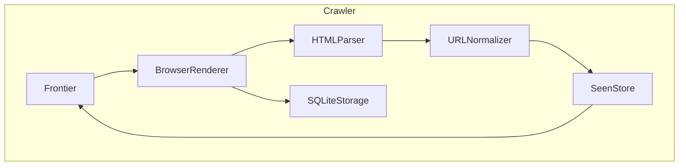

## Design Decisions - 

* Browser Rendering - Chrome DevTools Protocol is used instead of a traditional HTTP client because many websites generate content after JavaScript execution. Rendering the page inside Chrome allows the crawler to obtain the final DOM instead of only the initial HTML.

* Storage - SQLite is used instead of text files because it provides structured storage, efficient lookup, easier recovery after restart, and direct integration with the Indexer.

* Duplicate Detection - Handled by a Hashmap SeenStore that keeps track of already crawled URLs. This prevents the crawler from visiting the same URL multiple times .

* BFS Traversal - Breadth First Search is implemented using a Queue. Pages closer to the seed URL are processed first, improving crawl coverage.

* Modular Components - Each component of the crawler performs a single responsibility this reduces coupling and allows components such as HTMLParser and PatternMatcher to be reused in future projects and also changes in one component do not affect the others.

## Components -
### 1. Queue -
* Role - The queue is responsible for maintaing the order of Urls in the order they are discovered . It provides FIFO (first in first out) traversal required by the crawler's BFS strategy.

* Design - The queue is implemented using the CUSTOM SinglyList implemented in DS LIBRARY PROJECT. since a queue requires only enqueue from the rear and dequeue from the front, a singly linked list is suffiicient for this purporse which gives both operations in constant time O(1) also instead of exposing the linkedlist directly a seperate Queue is implemented to provide only queue operations to the crawler.

* Public APIs/Structure - 

```cpp 
template <typename T>
class Queue {
    private:
        SinglyList<T> list;
    public:
        void enqueue(const T& value);
        T dequeue();
        T& front() const;
        const T& front() const;
        bool empty() const;
        int size() const;
        void clear();
};
```
* Interal Representation -

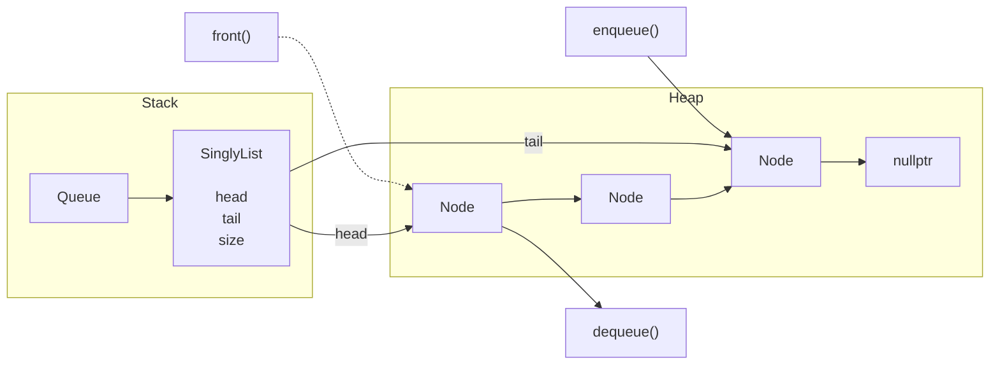

* Time Complexity - 
    * enqueue - O(1)
    * dequeue - O(1)
    * front - O(1)
    * empty - O(1)
    * size - O(1)
    * clear - O(n)

* A queue matches the BFS traversal used by the crawler whereas a dynamicarray would require shifting elements or implementing a circular queue while a doubly linked list would introduce additional overhead for maintaining previous pointers which is not required for FIFO operations .

### 2. URLDepth - 
* Role - URLDepth is a data structure that stores a URL along with its depth every entry inside the frontier will be a URLDepth object.

* Design - The URl and Depth are stored as a pair because they always travel together during crawling keeping them inside a single object prevents synchronization issues that could occure if seperate data structures were used .

* Public APIs/Structure - 

```cpp
struct URLDepth {
    string url;
    int depth;
};
```
* Internal Representation -

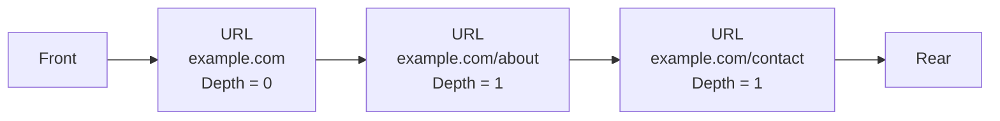

* Keeping both values together simplifies the frontier implementation and makes the interface cleaner by avoiding multiple parallel data structures.

### 3. Frontier - 
* Role - The frontier is a queue that stores the URLs to be crawled next. It implements the BFS traversal strategy by processing URLs in the order they are discovered.

* Design - The frontier is implemented using Queue<URLDepth> each queue entry stores both the URL and its depth.

* Public APIs/Structure - 

```cpp
class Frontier {
    private:
        Queue<URLDepth> queue;
    public:
        void enqueue(const URLDepth& urlDepth);
        URLDepth dequeue();
        URlDepth& front() const;
        bool empty() const;
        int size() const;
        void clear();
};
```
* Internal Representation -

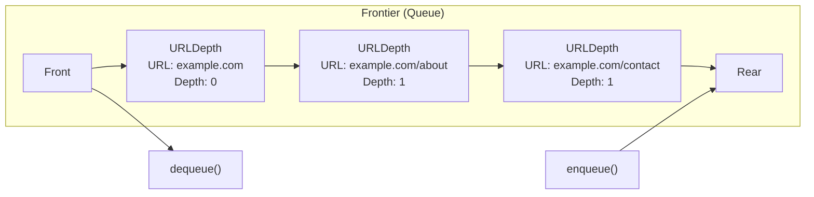

* Time Complexity - Same as queue

* Seperating Frontier from Queue keeps crawling logic independent from the linkedlist structure used to implement the queue. if the implementation has changes only the frontier needs to be updated.

### 4. SeenStore -
* Role - SeenStore prevents duplicate crawling by maintaining the crawling state of every discovered URL.

* Design - SeenStore is implemented using a HashMap<string,URLState> where URLState is an enum that can have values DISCOVERED,CRAWLED,FAILED. every url becomes part of seenstore when it is first discovered even before its crawled. This allows the crawler to avoid re-discovering the same URL multiple times. The state of each URL is updated as it progresses through the crawling process.

* Public APIs/Structure - 

```cpp
enum class URLState {
    DISCOVERED,
    CRAWLED,
    FAILED
};

Class SeenStore {
    private:
        HashMap<string,URLState> seen;
    public:
        bool contains(const string&)const;
        void add(const string&, URLState);
        URLState getState(const string&)const;
        void updateState(const string&, URLState);
        void rebuild(SQLiteStorage&);
        void clear();
        int size()const;
};
```
* Internal Representation -

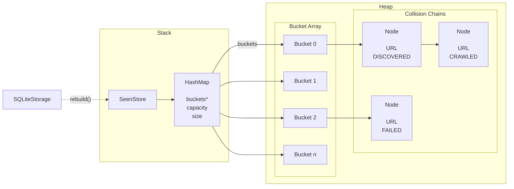

* Time Complexity - 
    * contains - Avg - O(1), Worst - O(n)
    * add - Avg - O(1), Worst - O(n)
    * getState - Avg - O(1), Worst - O(n)
    * updateState - Avg - O(1), Worst - O(n)
    * rebuild - O(n)
    * clear - O(n)
    * size - O(1)

* Checking only the Storage if the URL has been crawled would allow duplicate URLs to enter the frontier before they are stored. SeenStore performs duplicate detection immediately after URL extraction and before the URL is added to the frontier. This prevents duplicate URLs from entering the frontier and reduces unnecessary crawling.

### 5. PatternMatcher -
* Role - PatternMatcher provides reusable pattern searching functionality used by HTMLParser to extract URLs from the rendered HTML in this project and by the indexer in the next project to extract keywords from the rendered HTML.

* Design - PatternMatcher is implemented using the KnuthMorrisPratt (KMP) algorithm. The same implementation can be used to search for any pattern in a given text. The KMP algorithm is chosen because it has a linear time complexity O(n) .

* Public APIs/Structure - 

```cpp
class PatternMatcher {
    private:
        string pattern;
        DynamicArray<int> lps; // longest prefix suffix
        void computeLPSArray();
    public:
        bool contains(const string& text) const;
        int find(const string& text) const;
        DynamicArray<int> findAll(const string& text) const;
};
```
* KMP Workflow -

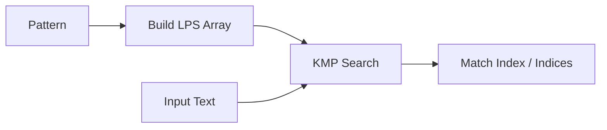

* Time Complexity - 
    * contains - O(n+m)
    * find - O(n+m)
    * findAll - O(n+m+k) 
    * where n is the length of the text, m is the length of the pattern, and k is the number of occurrences of the pattern in the text.

* KMP is chosen over naive string matching because it avoids unnecessary comparisons by using information from previous matches. This makes it more efficient for large texts and patterns, which is common in web crawling scenarios.

### 6. BrowserRenderer -
* Role - BrowserRenderer is responsible for rendering web pages using the Chrome DevTools Protocol (CDP) to obtain the final DOM after JavaScript execution.

* A seperate Documentation is provided for the BrowserRenderer component in docs/designproposal/BrowserRendererDesign.md which provides a detailed design of the BrowserRenderer component.

* Design - It has 4 major components - 
    1. ChromeProcess - Manages the lifecycle of the Chrome browser process, including starting and stopping the browser.
    2. HTTPClient - Handles communication with the Chrome DevTools Protocol over WebSocket, sending commands and receiving responses.
    3. WebSocketConnection - Manages the WebSocket connection to the Chrome DevTools Protocol, ensuring reliable message delivery and handling reconnections if necessary.
    4. CDPConnection - Provides a interface for sending commands to the Chrome DevTools Protocol and receiving events

* Workflow - 
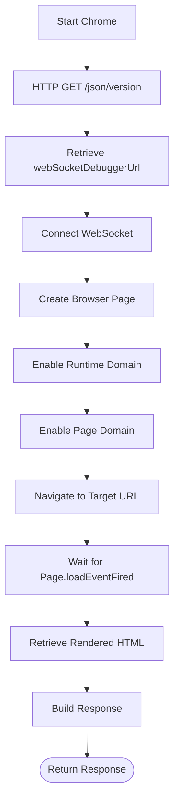

* Rendering Workflow -

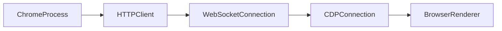

* Time Complexity - The time complexity of BrowserRenderer is primarily dependent on the network latency and the time taken by the browser to render the page. The actual rendering process is handled by the Chrome browser which is optimized for performance.

* CDP is used instead of a simple HTTP client because it allows the crawler to retrieve fully rendered, JavaScript-executed web pages, making it capable of crawling modern websites that cannot be accurately processed through HTTP requests alone

### 7. HTMLParser -
* Role - HTMLParser is responsible for extracting URLs from the rendered HTML content of web pages. It could be used in future projects to extract keywords from the rendered HTML for indexing.

* Design - HTMLParser uses the PatternMatcher component to search for anchor tags and extract the href attribute values. It also normalizes the extracted URLs using the URLNormalizer component before returning them.

* Public APIs/Structure - 
```cpp
class HTMLParser {
    public:
        DynamicArray<string> extractURLs(const string& html) const;
        //These methods can be used in future projects to extract keywords from the rendered HTML for indexing -
        string extractText(const string& html) const;
        string extractTitle(const string& html) const;
        string extractMetaDescription(const string& html) const;
};
```
* Internal Representation -

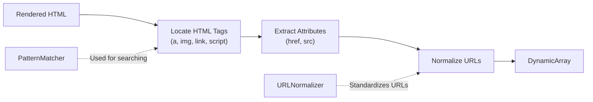

* Time Complexity - The time complexity of HTMLParser is O(n) where n is the length of the rendered HTML content. The extraction process involves scanning through the HTML content to find anchor tags and extract URLs, which can be done in linear time.

* HTMLParser is designed seperately to seperate parsing from rendering and crawling follows the single responsibility per component principle and allows the parser to be reused in future projects for extracting keywords from the rendered HTML for indexing.

### 8. URLNormalizer -

* Role - URlNormalizer is responsible for normalizing URLs to a standard format before they are stored in the SeenStore or added to the Frontier. This ensures that different representations of the same URL are treated as duplicates.

* Design - Every extracted URL passed through the normalizer before duplicate detection , The process consists of - 
    * Resolving relative URLs to absolute URLs based on the base URL of the page.
    * Lowering the case of host of the URL.
    * Remove fragments from the URL.
    * Normalize trailing slashes 
    * validate the URL format to ensure it is valid URL.
    * only allow http and https schemes to be added to the frontier.

* Public APIs/Structure - 
```cpp
class URLNormalizer {
    public:
        string normalize(const string& url, const string& baseUrl) const;
        isValidURL(const string& url) const;
};
```

* Internal Representation -

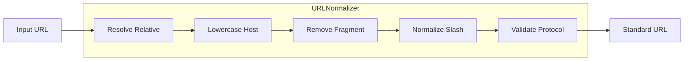

* Time Complexity - The time complexity of URLNormalizer is O(n) where n is the length of the URL being normalized. The normalization process involves string manipulations and checks that can be performed in linear time.


### 9. Storage -
* Role - Storage is responsible for storing the rendered HTML content of crawled web pages in a SQLite database. This allows the indexer in the next project to access the stored content for indexing and searching.

* Design - Each succesfully rendered page is stored immediately after rendering in the SQLite database. The crawler stores the rendered HTML without modifying it , allowing indexer to process the original content again without revisiting the website

* Public APIs/Structure - 
```cpp
class Storage {
    public:
        bool storepage(const Response* response,int depth);
        Response getpage(int id);
        bool haspage(const string& url);
        string getpageurlbyid(int id);
        int pagecount()const;
};
```
* Internal Representation -

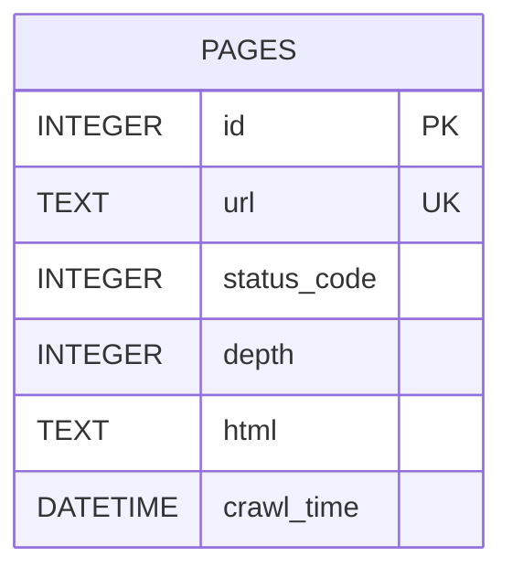

* SQLite Table Structure -

```sql
CREATE TABLE pages (
    id INTEGER PRIMARY KEY AUTOINCREMENT,
    url TEXT NOT NULL UNIQUE,
    depth INTEGER NOT NULL,
    html TEXT NOT NULL
);

CREATE INDEX idx_pages_depth ON pages(depth);
```

* Table Meaning -
    * id - Unique identifier for each stored page.
    * url - Final normalized URL of the crawled page.
    * depth - Crawl depth from the seed URL.
    * html - Fully rendered HTML returned by BrowserRenderer.

* Time Complexity - The time complexity of Storage operations is primarily dependent on the underlying SQLite database operations. In general, the average time complexity for storing and retrieving pages is O(log n) due to the indexing and searching capabilities of SQLite.

* SQLite provides structured storage , fast lookup , persistent restart and direct compatibility with the indexer it also remove the need to manage multiple text files manually.

### 10. Crawler -
* Role - Crawler is the main component that handles the crawling process. It manages the flow of URLs through the various components, ensuring that pages are rendered, parsed, and stored correctly.

* Design - The crawler does not perform rendering , parsing , storage , normalization or duplicate detection itself , it delegates each task to the appropriate component while maintaining the overall crawl workflow.

SEED URL -> URLNormalizer -> Duplicate Check -> SeenStore -> Frontier (BFS) -> BrowserRenderer -> Storage -> HTMLParser -> Extracted URLs -> URLNormalizer -> SeenStore -> Frontier

* Public APIs/Structure - 
```cpp
class Crawler {
    private:
    //Each component performs one specific task , while the crawler manages the execution order 
        URLNormalizer urlNormalizer;
        SeenStore seenStore;
        Frontier frontier;
        BrowserRenderer browserRenderer;
        Storage storage;
        HTMLParser htmlParser;
        bool stopCrawling;
    public:
        Crawler();
        void crawl(const string& seedUrl, int maxDepth);
        void stop();
};
```

* Workflow of the Crawler -

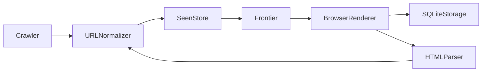

* Time Complexity - The overall time complexity of the Crawler is dependent on the number of pages crawled, the depth of the crawl, and the efficiency of each component. The crawler's performance is influenced by network latency, rendering time, and database operations.

* Keeping the crawler as the main controlling component avoids creating a large monolithic class that handles all tasks . The design is modular, easier to maintain and allows invdividual components to be tested or replaced independently. It also makes it easier to extend the project further by adding indexer in project 3 which would be easier to integrate without modifying the crawling logic.

* The crawler can be extended to support multi-threading in future versions to improve performance and scalability.

## Workflow -
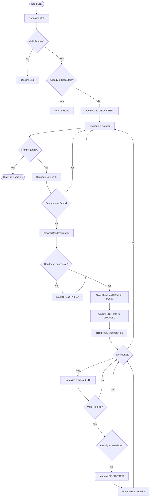

1. The crawler starts with a seed URL and normalizes it using the URLNormalizer.
2. The normalized URL is checked against the SeenStore to determine if it has already been discovered or crawled.
3. If the URL is new, it is added to the SeenStore and marked as DISCOVERED, and then enqueued into the Frontier for crawling.
4. The crawler dequeues a URL from the Frontier and passes it to the BrowserRenderer for rendering.
5. The BrowserRenderer uses the Chrome DevTools Protocol to render the page and obtain the final DOM after JavaScript execution.
6. The rendered HTML is stored in the SQLite database using the Storage component.
7. The HTMLParser extracts URLs from the rendered HTML and normalizes them using the URLNormalizer.
8. Each extracted URL is checked against the SeenStore to avoid duplicates. New URLs are added to the SeenStore and enqueued into the Frontier for further crawling.
9. The process continues until the Frontier is empty or a specified maximum depth is reached.

## Failure Handling
* The crawler handles common failures without stopping crawling invalid pages are skipped and the crawler continues with the remaining URLs in the frontier

* Failures -
    * Invalid URL - If a URL is invalid or unsupported it is skipped and not added to the frontier
    * Network Errors - If a page fails to download due to network errors it is skipped and the crawler continues with the remaining URLs in the frontier
    * Duplicate URLs - If a URL has already been seen it is skipped and not added to the frontier
    * Malformed HTML - If a page contains malformed HTML the parser skips the invalid parts and extracts the valid links from the rest of the page
    * Empty Page - If a page is empty it is skipped and the crawler continues with the remaining URLs in the frontier
    * Maximum Depth Reached - If a page is at the maximum depth it is not added to the frontier and the crawler continues with the remaining URLs in the frontier

## Future Comatibility -
* The crawler has been designed so that the next project can directly reuse its output without modifying the crawling process.

* The Indexer will:

    * Read rendered HTML directly from SQLiteStorage.
    * Use HTMLParser to extract page titles, visible text, and metadata.
    * Build an inverted index from the extracted content.
    * Avoid downloading pages again because the rendered HTML is already available in the database.
    * The indexer can iterate over all stored pages by calling pagecount() and getURLbyID() the returned URL is then used with getpage() to retrieve corresponding HTML and build the indexer

* Since each crawler component has a single responsibility, additional features can be added with minimal changes to the existing architecture.

## Complexity Summary - 
| Component       | Primary Operation | Complexity                                  |
| --------------- | ----------------- | ------------------------------------------- |
| Queue           | Push / Pop        | O(1)                                        |
| Frontier        | Push / Pop        | O(1)                                        |
| SeenStore       | Lookup            | Average O(1), Worst O(n)                    |
| PatternMatcher  | Search            | O(n + m)                                    |
| HTMLParser      | Link Extraction   | O(n)                                        |
| URLNormalizer   | Normalize URL     | O(n)                                        |
| BrowserRenderer | Render Page       | Depends on network and page rendering       |
| SQLiteStorage   | Store / Retrieve  | Depends on indexed database operations      |
| Crawler         | Complete Crawl    | Depends on pages crawled and rendering time |
